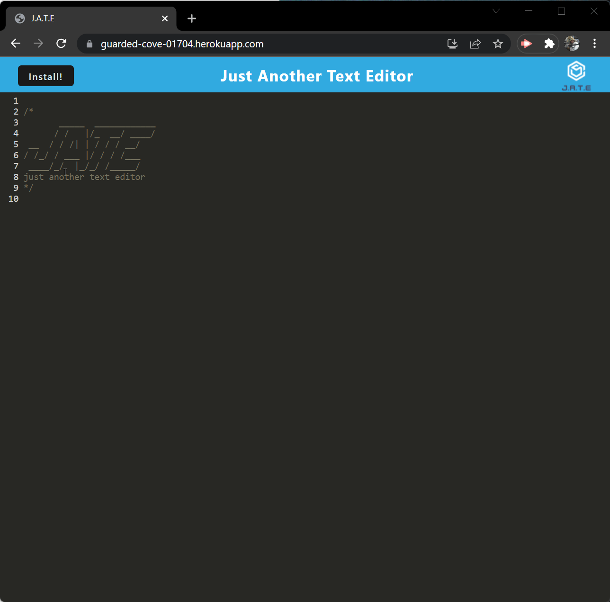

# Text-Editor

## Description

This application is supposed to allow you to edit text in a browser, then download that application through PWA practices. It uses a service worker to cache items and controls the processes on the page.

## [Try it yourself!](https://github.com/JaggedComet/Text-Editor)

[Heroku Link](https://guarded-cove-01704.herokuapp.com)

## Demo

<br>


## Installation

For the application to function, you need a coding software like the free [VScode](https://code.visualstudio.com/download), you will just install the required npms with ```npm i``` on the command line in the coding software you are using.

## Usage

You will first begin by doing a `git clone git@github.com:JaggedComet/Text-Editor.git` in your command line at the destination of your choice using [GitBash](https://git-scm.com/downloads) or any other commandline interface. Then you will go to the command line in `VsCode` or the coding software of your choice and run `npm i` in order to install the required files. Then you would run `npm run start:dev` in order to run the application. Then you will go to `localhost:3000` on your browser and start editing the text editor and install the app in the end.

## Technology

Here is the technology used along with links to them where applicable:

- [VScode](https://code.visualstudio.com/download)<br>
- [Babel Loader](https://www.npmjs.com/package/babel-loader)<br>
- [Webpack Config](https://www.npmjs.com/package/webpack)<br>
- JavaScript<br>


## Credits

Special thanks to David, who worked with me for three days trying to get this project done: <br>
- Github: [David Luu](https://github.com/MaestroLuu/) 


## Questions

If you have any additional questions regarding this application, please contact me via the channels provided below:<br />
____________________________________
Github:https://github.com/JaggedComet/<br>
Email: MarcoFlores1029@gmail.com<br>
